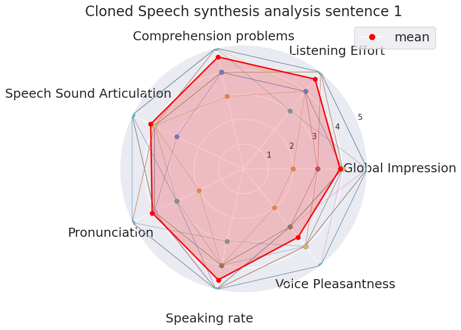
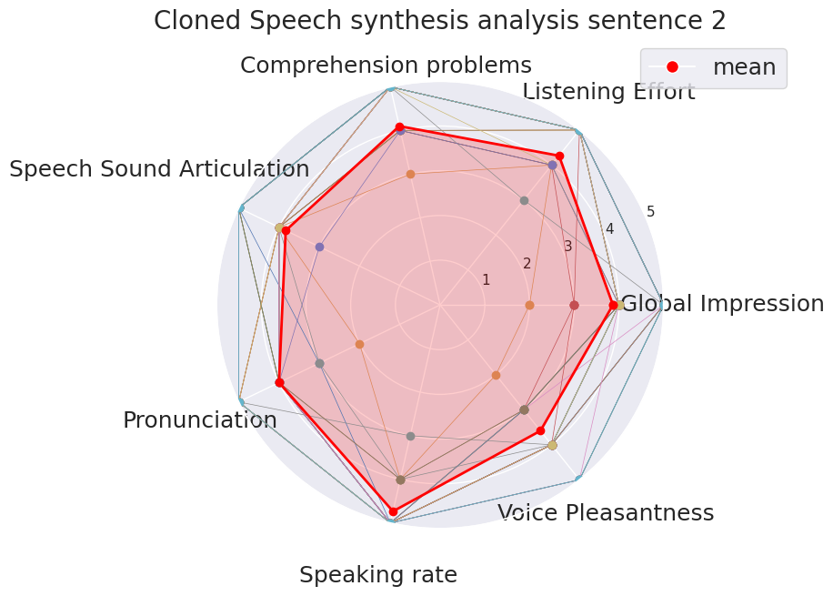
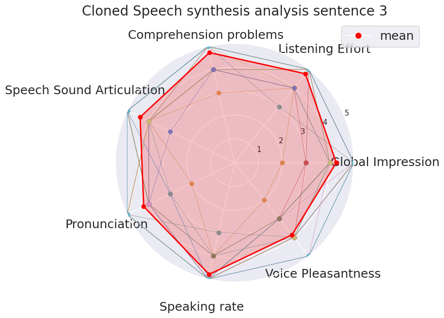
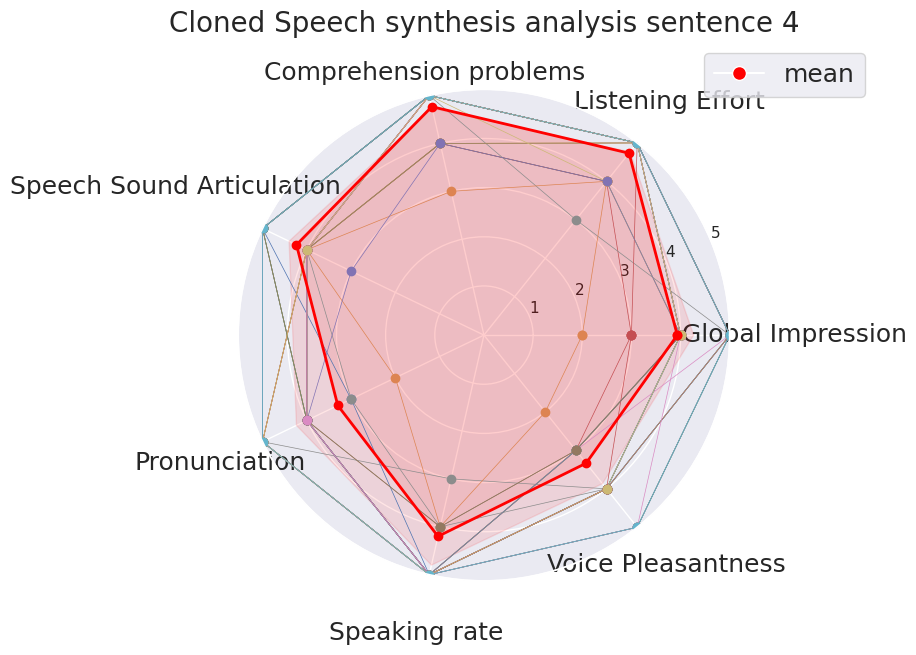

# OPEN-SOURCE SYSTEM FOR MULTILINGUAL TRANSLATION AND CLONED SPEECH SYNTHESIS

#### Authors: Mateo Cámara, Juan Gutérrez, María Pilar Daza, José Luis Blanco

#### Abstract:
We present an open-source system designed for multilingual translation and speech regeneration, addressing challenges in communication and accessibility across diverse linguistic contexts. The system integrates Whisper for speech recognition with Voice Activity Detection (VAD) to identify speaking intervals, followed by a pipeline of Large Language Models (LLMs). For multilingual applications, the first LLM segments speech into coherent, complete sentences, which a second LLM then translates. For speech regeneration, the system uses a text-to-speech (TTS) module with voice cloning capabilities to replicate the original speaker’s voice, maintaining naturalness and speaker identity.

The system’s open-source components can operate locally or via APIs, offering cost-effective deployment across various use cases. These include real-time multilingual translation in Zoom sessions, speech regeneration for public broadcasts, and Bluetooth-enabled multilingual playback through personal devices. By preserving the speaker’s voice, the system ensures a seamless and immersive experience, whether translating or regenerating speech.

This open-source project is shared with the community to foster innovation and accessibility. We provide a detailed system performance analysis, including latency and word accuracy, demonstrating its potential to enable inclusive, adaptable communication solutions in real-world multilingual scenarios.

---

### Subjects' scoring per sentence

|  |  |
|-----------------------------------|-----------------------------------|
|  |  |

---

### Audio files presented to subjects

#### Single audio files
<audio controls>
  <source src="audios/1.wav" type="audio/wav">
Your browser does not support the audio element.
</audio>

<audio controls>
  <source src="audios/2.wav" type="audio/wav">
Your browser does not support the audio element.
</audio>

#### Paired audio files

| Test audio | Reference audio |
|------------|-----------------|
| <audio controls><source src="audios/3.wav" type="audio/wav"></audio> | <audio controls><source src="audios/ref3.wav" type="audio/wav"></audio> |
| <audio controls><source src="audios/4.wav" type="audio/wav"></audio> | <audio controls><source src="audios/ref4.wav" type="audio/wav"></audio> |