# High-Throughput Image Analysis Reveals Morphological Differences in Precipitates for Enhanced Filterability

## Authors

Maria del Carme Pons Royo, Mateo Camara Largo, Didac Alonso Lopez, Soroush Ahmadi, Andrew Hatas, Allan S. Myerson, Richard D. Braatz.

## Abstract

The integration of precipitation as a non-chromatographic, non-titer-dependent capture method has received increasing attention in continuous bioprocessing for high-value therapeutics. Precipitation provides a scalable and cost-effective approach to separate biomolecules by reducing their solubility through changes in pH, ionic strength, or the addition of precipitating agents. However, solid-liquid separation is an essential step to remove precipitates from the liquid phase following their formation. This is typically achieved using tangential flow filtration (TFF). To enable continuous operation of TFF, it is crucial to maintain stable filtration performance over time. A key factor in this context is the critical flux, defined as the maximum permeate flux that can be sustained without significant membrane fouling. Previous studies have demonstrated that factors such as buffer composition, salt type, and precipitant addition strategy significantly affect precipitate morphology and filterability. Accurate assessment of packing density is essential for predicting filtration performance; however, conventional techniques to determine the packing density such as centrifugation and microscopy suffer from limitations related to throughput, sample volume requirements, and reproducibility. To address these challenges, a high-throughput image analysis-based method has been developed to evaluate the filterability of precipitated biomolecules, with mRNA serving as a model system. Morphological features extracted from visual data, including precipitate size, eccentricity, and distribution, enable rapid screening of precipitation conditions. This approach facilitates the identification of optimal salts and additives to improve precipitation efficiency and downstream recovery, supporting the advancement of scalable precipitation-based capture strategies within integrated continuous biomanufacturing.

## Technical Details

- **Well Images**: Compressed to ~100KB for web optimization (high quality images are shared upon request)
- **Graph Images**: Histogram plots showing hue, saturation and value distribution analysis

## Well Images and Analysis

This page presents the analysis results for each well, showing the original well image, its segmented area, alongside hue, saturation and value histograms.

Each row contains:
- **Well Image**: Processed microscopy image of the well with segmented area in green
- **Hue Histogram**: Distribution of hue values in the well
- **Saturation Histogram**: Distribution of saturation values in the well
- **Value Histogram**: Distribution of value (brightness) in the well

---

### Row 1

#### Well A10

  
  
  
  

#### Well A11

  
  
  
  

#### Well A12

  
  
  
  

#### Well B10

  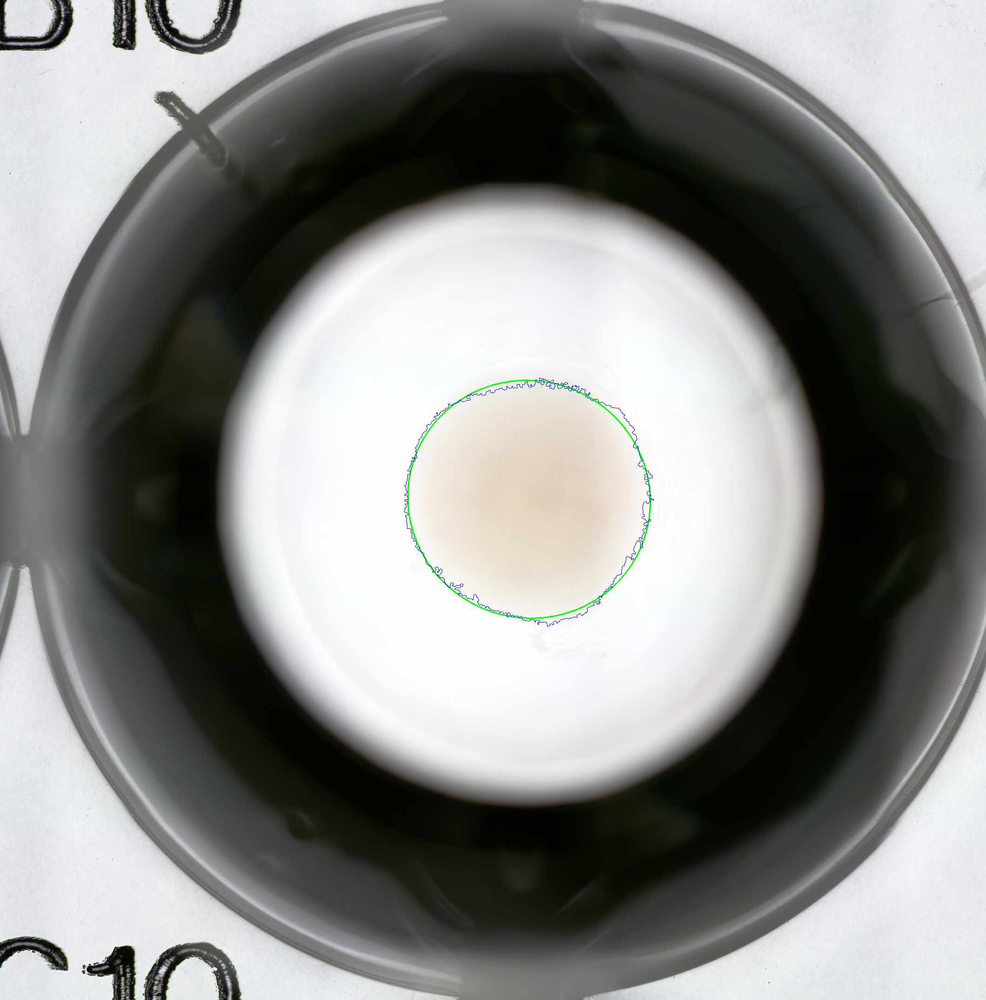
  
  
  

---

### Row 2

#### Well B11

  
  
  
  

#### Well B12

  
  
  
  

#### Well B2

  
  
  
  

#### Well B3

  
  
  
  

---

### Row 3

#### Well B4

  
  
  
  

#### Well B6

  
  
  
  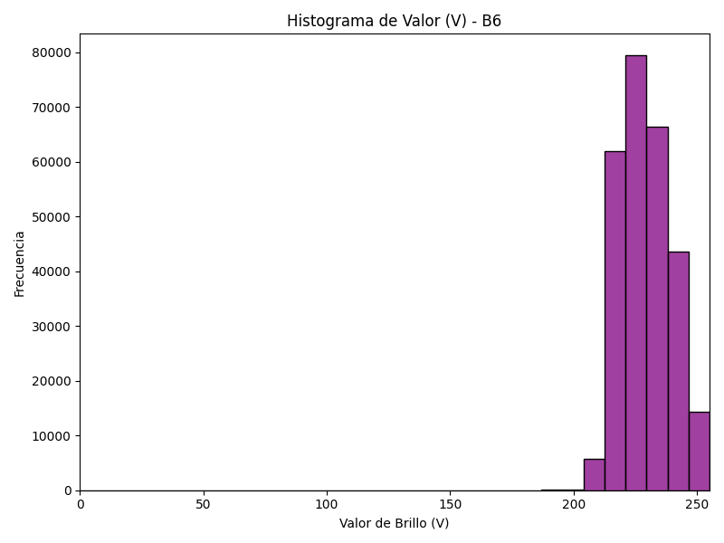

#### Well B7

  
  
  
  

#### Well B8

  
  
  
  

---

### Row 4

#### Well C10

  
  
  
  

#### Well C11

  
  
  
  

#### Well C12

  
  
  
  

#### Well C2

  
  
  
  

---

### Row 5

#### Well C3

  
  
  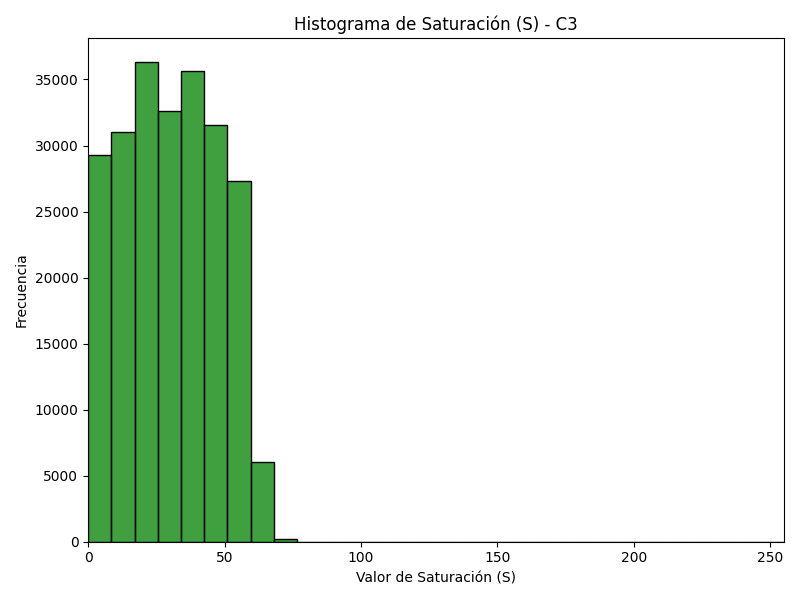
  

#### Well C4

  
  
  
  

#### Well C6

  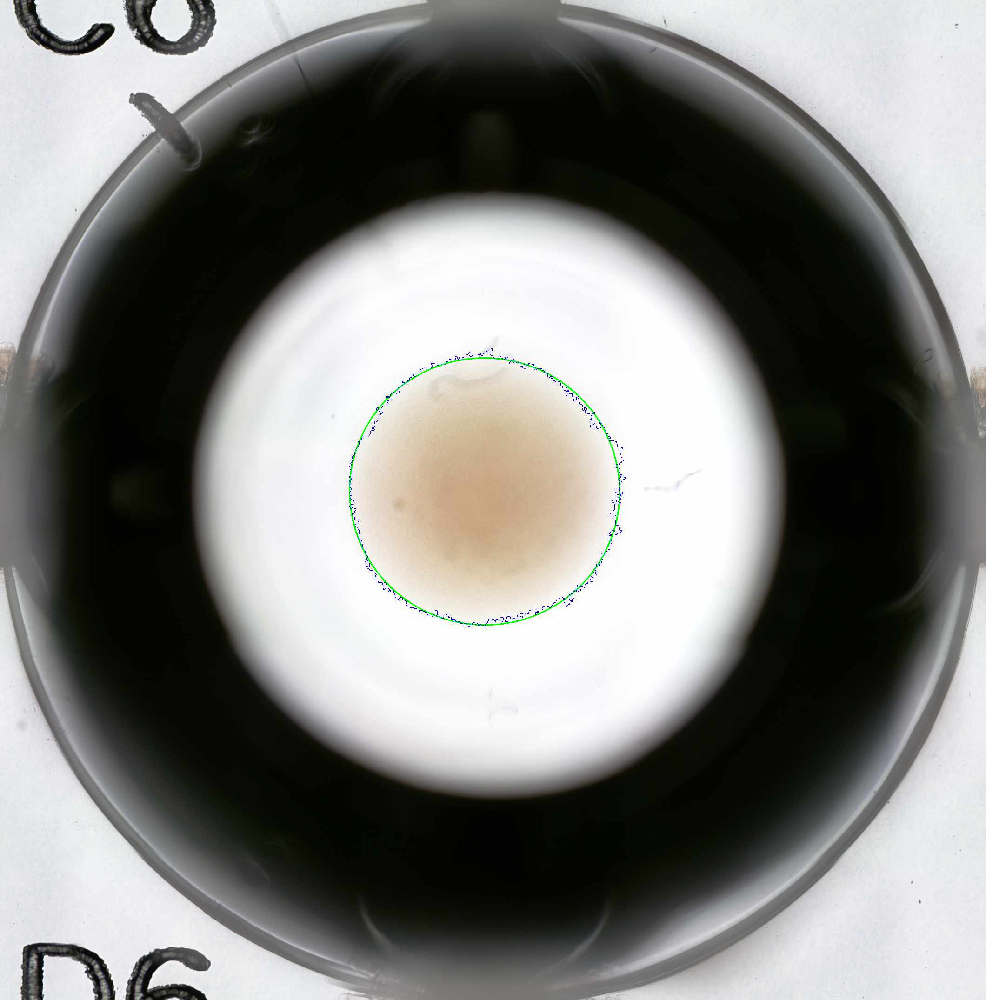
  
  
  

#### Well C7

  
  
  
  

---

### Row 6

#### Well C8

  
  
  
  

#### Well D10

  
  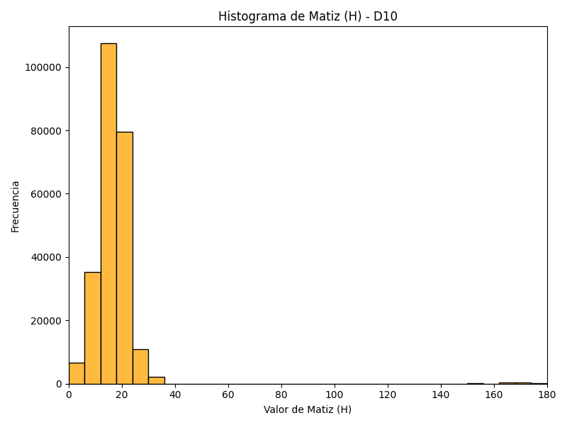
  
  

#### Well D11

  
  
  
  

#### Well D12

  
  
  
  

---

### Row 7

#### Well D2

  
  
  
  

#### Well D3

  
  
  
  

#### Well D4

  
  
  
  

#### Well D8

  
  
  
  

---

### Row 8

#### Well E10

  
  
  
  

#### Well E11

  
  
  
  

#### Well E12

  
  
  
  

#### Well E2

  
  
  
  

---

### Row 9

#### Well E3

  
  
  
  

#### Well E4

  
  
  
  

#### Well E6

  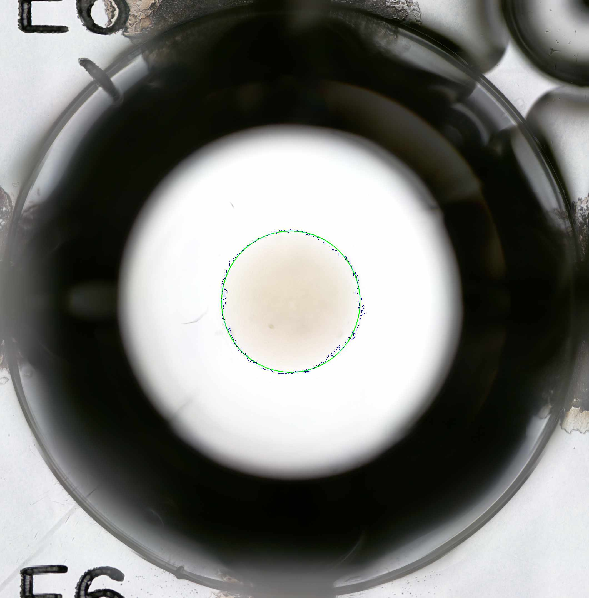
  
  
  

#### Well E7

  
  
  
  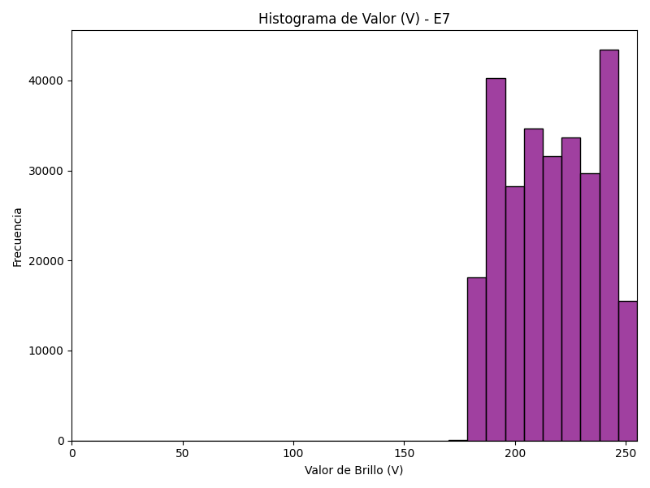

---

### Row 10

#### Well E8

  
  
  
  

#### Well F10

  
  
  
  

#### Well F11

  
  
  
  

#### Well F12

  
  
  
  

---

### Row 11

#### Well F2

  
  
  
  

#### Well F3

  
  
  
  

#### Well F4

  
  
  
  

#### Well F6

  
  
  
  

---

### Row 12

#### Well F7

  
  
  
  

#### Well F8

  
  
  
  

#### Well G11

  
  
  
  

#### Well G12

  
  
  
  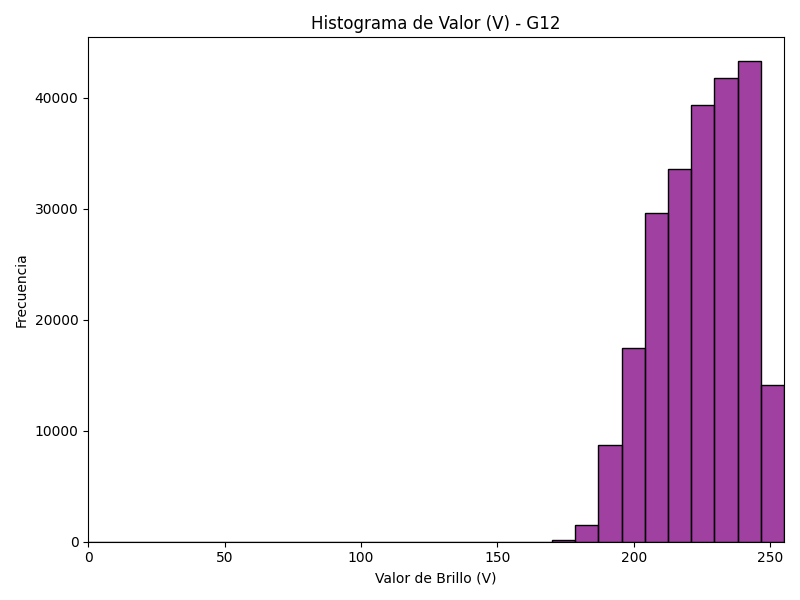

---

### Row 13

#### Well G2

  
  
  
  

#### Well G3

  
  
  
  

#### Well G4

  
  
  
  

#### Well G6

  
  
  
  

---

### Row 14

#### Well G7

  
  
  
  

#### Well G8

  
  
  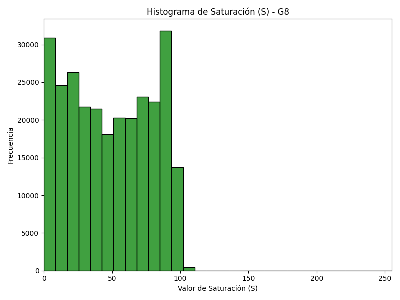
  

#### Well H11

  
  
  
  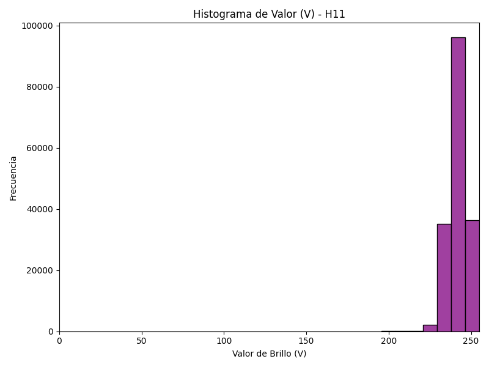

#### Well H12

  
  
  
  

---

### Row 15

#### Well H3

  
  
  
  

#### Well H4

  
  
  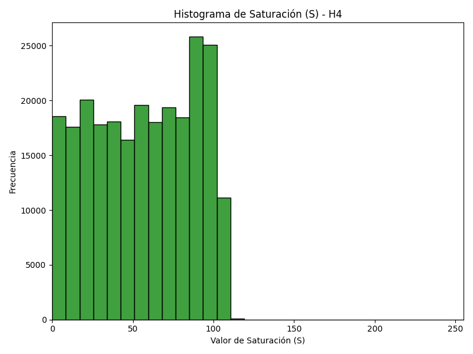
  

#### Well H7

  
  
  
  

#### Well H8

  
  
  
  

